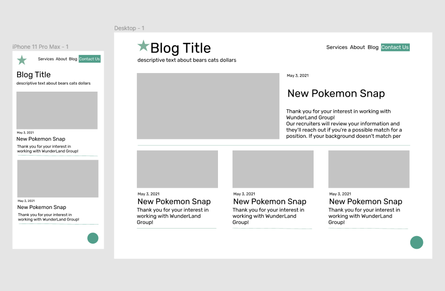
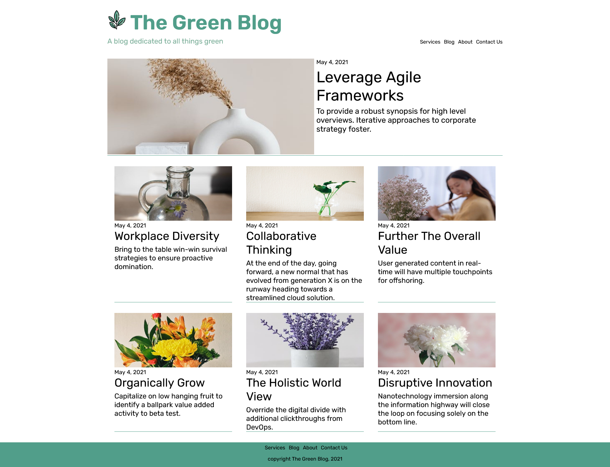
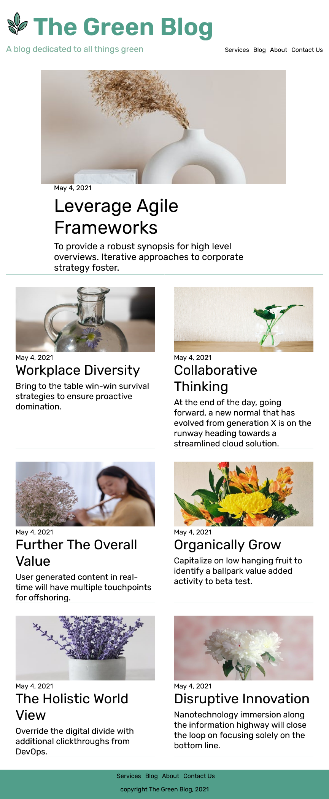
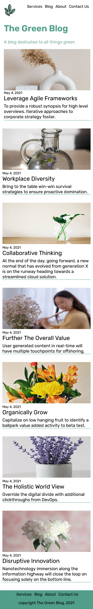

# Blog Template/Example

## Overview

This is an example of a blog landing page. I made this to practice design, mobile responsiveness and SASS.

## Screenshots

Figma mockups:

Large desktop:

Small desktop:

Mobile:

## Links

[live site](https://juliaarrington.com/portfolio/green-blog/index.html)

## My Process

I want to become a better designer so I decided to try my hand at the quintessential website: the blog. I tried to make my design clean and easy to understand.\
I also wanted to focus on responsive design. During my last project I realized I'm not as good at responsive design as I would like to be. I'm happy with how the featured post turned out. I think it was a good idea to have a big/small/mobile version. I'm not happy with how the grid of posts turned out. I think I need to research what solutions other developers have come up with.\
While I was at it I took this as an opportunity to learn SASS. I really like it and I wish I had started using this library earlier. I will definitely dig more into the advanced features in my next project.\
This took me roughly 7.5 hrs.

## Continued Development

As mentioned, I may make some changes to the grid. Also I may make a dummy post page for fun.
